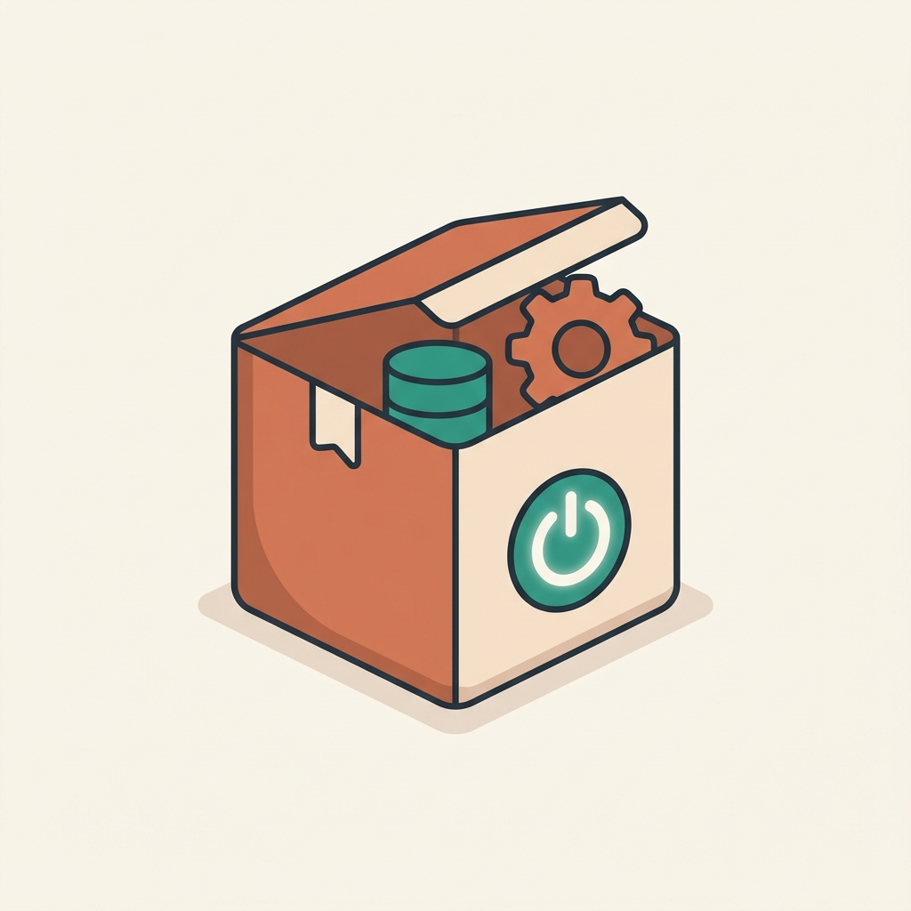
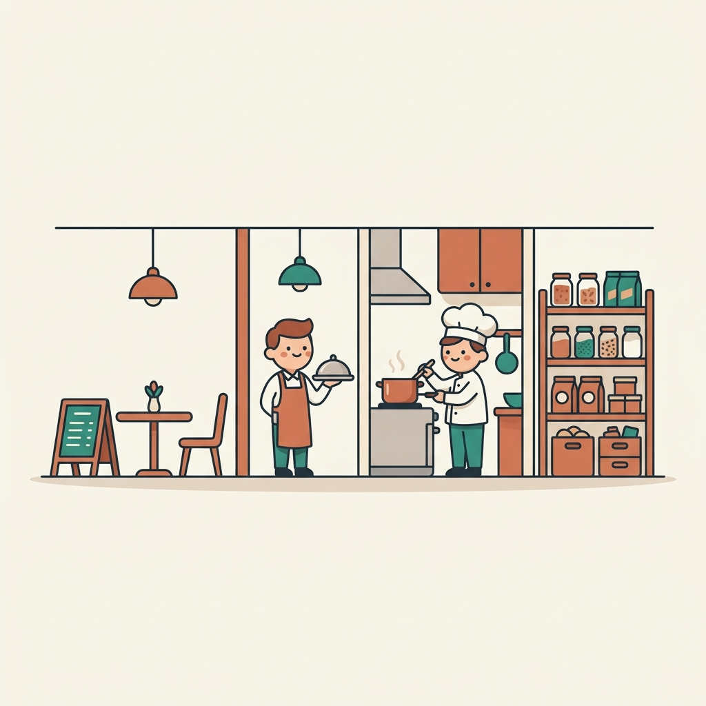
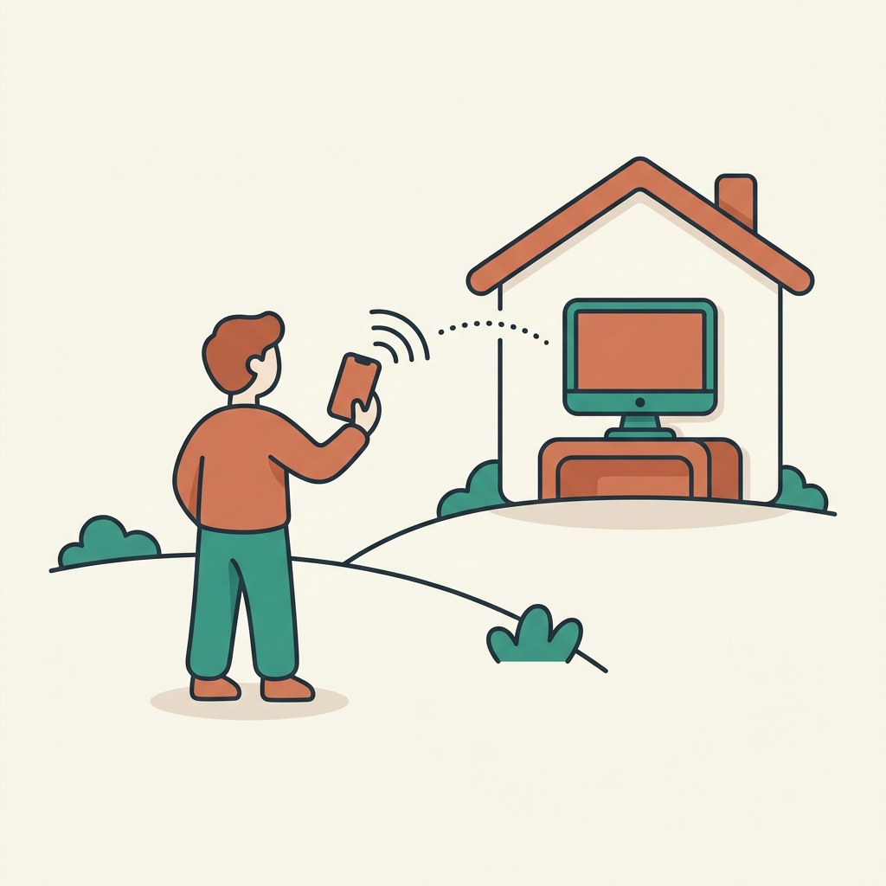
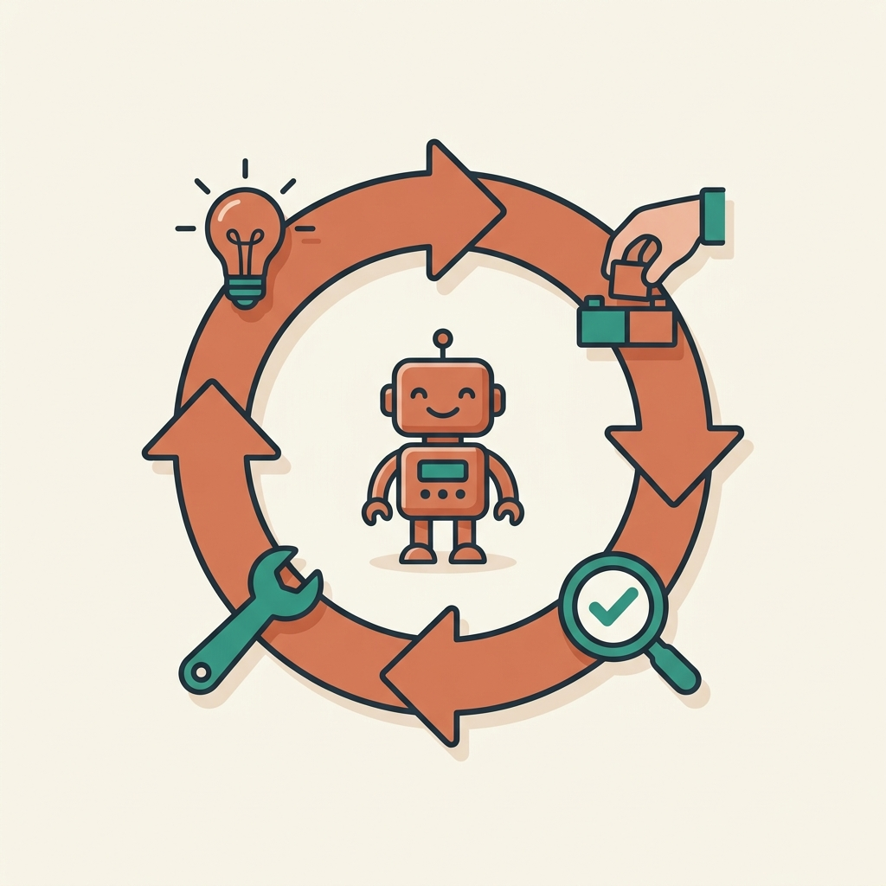
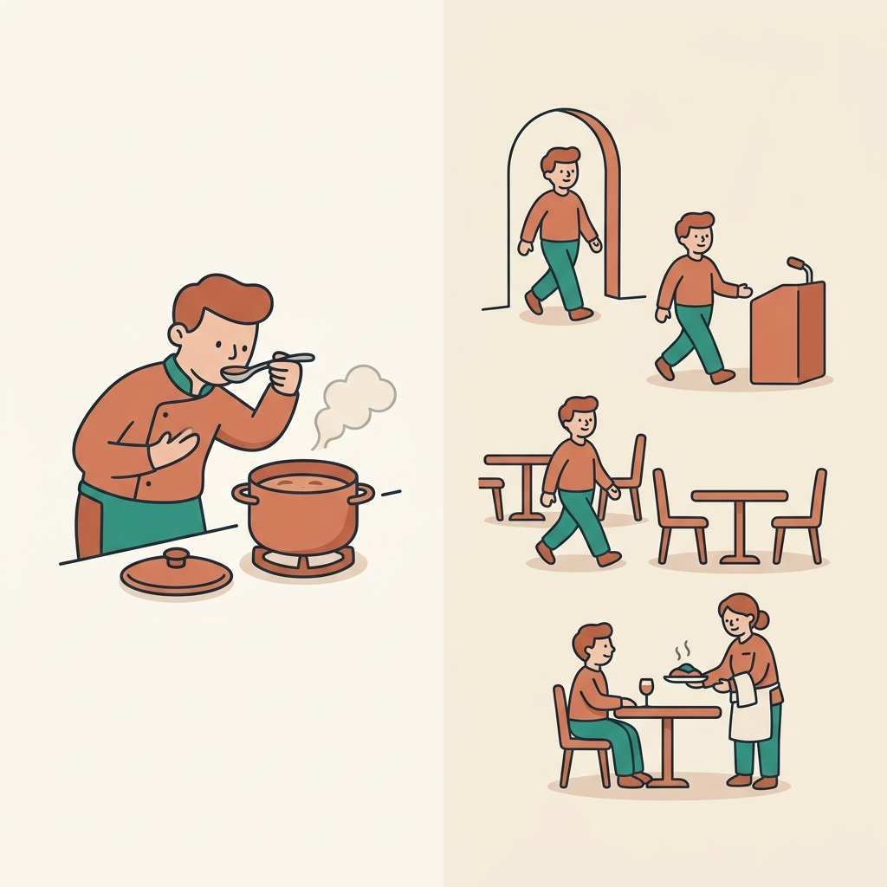
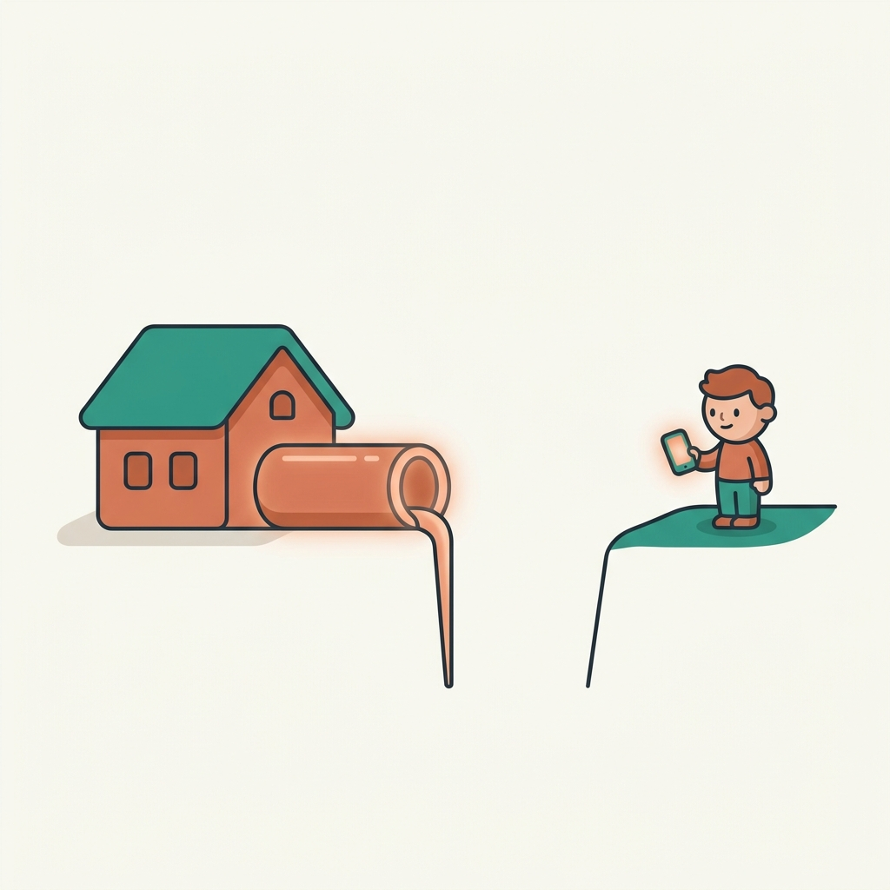

<!-- _class: title -->
<!-- _paginate: false -->

CLAUDE CODE 勉強会 / 4時間

# はじめてのClaude Code

## 手を動かして“動くもの”を作る4時間

by Seiya

<!-- 最初の10分：自己紹介＋今日の流れ。気楽に、専門知識ゼロ前提で話す。 -->

---

## 自己紹介（テンプレ・自由に書き換え）

- 名前 / ふだんやっていること
- なぜこの会を開いたのか（ひとことで）
- 今日のスタンス：**「全部わからなくてOK。動けば勝ち」**

今日は“エンジニアになる会”ではありません。**AIに頼んで、自分のアイデアを動く形にする**会です。

---

## 今日のゴール

**自分のパソコンで動く「お店の予約サイト」を作って、 ngrokで“友達に送れるURL”にするところまで。**

- むずかしいサーバー契約・公開設定はしません
- 途中で迷っても大丈夫。あとで見返せる記事も用意しています
- 遅れて来た人も、記事の途中から合流できます

---

## 今日の流れ（4時間）

| 時間 | 内容 |
|---|---|
| 0:00–0:10 | 自己紹介・今日の流れ・**完成形デモ** |
| 0:10–0:45 | みんなで準備（アプリ・ログイン・**Docker**・ngrok） |
| 0:45–1:05 | 最低限の地図（言葉と仕組み） |
| 1:05–1:15 | 休憩 |
| 1:15–2:00 | ハンズオン①：AIにブラウザで調べ物→表に |
| 2:00–3:35 | ハンズオン②：予約サイトを作って公開 |
| 3:35–4:00 | まとめ・自分のアイデアを試す・質問 |

---

## まず完成形を見てもらいます（デモ）

これから30秒。**「予約サイトが動いて、URLを友達に送れる」**ところまでを先に見せます。

- ゴールが見えていると、途中の作業が迷子になりません
- 「あれを自分で作るのか」という感覚を持って始めましょう

<!-- ここでSeiyaが実際にローカル起動→ngrok→スマホで開く、までライブ。 -->

---

## 準備でいれるもの（始める前に）

- **Claude Desktop アプリ**今日の作業場（Codeタブを使う）
- **Docker**アプリを“箱ごと”動かす道具（あとで予約システムで使用）
- **ngrok**あとでURLを公開する道具（authtokenは準備済み）

ここでみんなで一緒にインストール＆ログイン。**詰まっても大丈夫、声をかけてください。**

※ Windowsの人は **Git** も。git を使うためではなく、**Claude Code がコマンドを動かす土台**として必要（Macは標準装備）。

---

## Docker（ドッカー）とは

Dockerアプリを“箱（コンテナ）”ごと、そのまま動かす仕組み

- ふつう、ソフトは使う前に**面倒なインストール**が必要
- Dockerなら、**必要なものが箱に入った状態**で来る → 動かすだけ
- PC（Mac / Windows）の違いで「自分だけ動かない」が起きにくい

今日は、予約システムの **データベース（PostgreSQL）** や **Go** を動かすのに使います。 
（Node.js / npm は Claude が各自のPCに入れてくれるので、そちらはDocker不要）

注意：Docker Desktopは**アプリを開いて動かしたまま**にしておく必要があります（閉じると中の箱も止まる）。

---

<!-- _class: section -->
<!-- _paginate: false -->

PART 1

# 最低限の地図
### 〜言葉は“使う直前に1個ずつ”〜

---

## そもそもClaude Codeって何？

LLMネットの文章を大量に読んだ“物知りな助手”

Claudeその助手のひとり（Anthropic社製）

Claude Codeその助手に“手”を付けたもの

> ふつうのAIは「答えを言う」だけ。**Claude Codeは、あなたのPCを実際に操作して、ファイルを作ったり動かしたりできる。**

---

## なぜ今、こんなに急に広まった？

- **言葉で頼める**：呪文のようなコードを覚えなくていい
- **自分で手を動かす**：提案だけでなく、実際に作って・試して・直す
- **失敗を自分で直す**：エラーが出たら自分で原因を探して修正
- **道具につながる**：あとで出てくるMCPで世界中のサービスと接続

要するに「**作れる人の条件**」が、“コードが書ける”から“**やりたいことを言葉にできる**”に変わった。

---

## Webサービスを“レストラン”でイメージ

  
<b>客席・メニュー</b>フロントエンド 見える画面

  
→

  
<b>ウェイター</b>API 注文を運ぶ窓口

  
→

  
<b>厨房</b>バックエンド 実際の調理＝処理

  
→

  
<b>食材庫</b>データベース データの保管

- サーバーこの“お店”そのもの（動かす場所）
- クラウドサーバー店を買わずに借りる

---

## 今日の“サーバー”は怖くない

今日の「サーバー」は、**あなたのPCの中で一時的に動くだけ**。 
クラウド契約も難しい設定もナシ。Claude Codeが起動してくれます。

- ngrokそのPCに“公開の住所”を一本だけ通す道具
- だから**友達がスマホからアクセスできる**
- インターネット＝そのお店に世界中からアクセスできる道

---

## Claude Codeが得意なこと

- 小さなWebアプリ・ツール・自動化を**ゼロから形にする**
- 既にあるものの**修正・改善・説明**
- **調べ物**や**面倒な手作業**の自動化（後でやります）
- 「とりあえず動く試作（モック）」を**速く**作る

苦手：あいまいな丸投げ、正確さが命の計算の検算なし運用、最新すぎる情報。 
→ **具体的に頼む・結果を自分で確認する**のが大事。

---

<!-- _class: section -->
<!-- _paginate: false -->

PART 2

# Claude Codeの基本機能
### 画面・remote-control・MCP・Skills

---

## 画面の使い方（Claude Desktop）

- **Code**タブを開く → **Local** → 作業フォルダを選ぶ
- 頼みごとを書くと、Claudeが**変更案**を出す
- 差分（diff）どこが変わるかの表示を見て **Accept / Reject**
- **Preview**：作ったアプリをアプリ内で起動して見られる

ポイント：**いつでも止められる・言い直せる**。気軽に試してOK。

---

## remote-control（リモート操作）

remote-controlスマホからPCのClaude Codeに指示を送る

- 外出先からスマホで「これやっといて」と投げる
- PC側のClaude Codeが受け取って作業
- “PCの前にいなくても進む”感覚

※ 新しめの機能です。今日は概念の紹介まで（時間が余れば触ります）。

---

## MCP（コネクタ）とは

MCPAI用の“USB端子”。外部サービスに挿す仕組み

- Claude Code単体は「自分のPCの中」が基本
- **MCPを挿す**と、外の世界（地図・メール・カレンダー等）につながる
- 「コネクタ」という言い方もします

今日のハンズオン①で、**ブラウザを操作するMCP（Playwright MCP）**を実際に使います。

---

## MCPの活用例（今日はやらない・紹介だけ）

### 📧 Gmail
メールを読み取って **下書き・自動返信**を作る

### 💬 Slack
チャンネルを読み取って **返信案**を用意する

### 📅 Googleカレンダー
予定を読み込んで **今日の予定を把握**

 

> 「自分の道具に“挿す”だけで、AIができることが一気に広がる」── これがMCPの面白さ。

メールやチャットの**自動送信**は事故のもと。実運用では「**下書きまで**＝人が最後に確認」が安全。

---

## Skills（スキル）とは

Skillsよく使う“作業手順書”をまとめたパック

- Claude Codeに「この手順でやって」と覚えさせておけるもの
- 画面で **`/`** を打つと呼び出せる
- 毎回ゼロから説明しなくてよくなる

今日は **`idea-to-mockup`** というスキルを用意しました。 
質問に答えるだけで、**自分のアイデアの試作**ができます（最後に使います）。

---

## Agentic loop（自分で回す仕組み）

Agentic loop考える→やる→結果を見る→直す、を自分で繰り返す

  
<b>考える</b>何をすべきか

  
→

  
<b>やる</b>ファイル作成・実行

  
→

  
<b>確認</b>結果・エラー

  
→

  
<b>直す</b>必要なら修正

- 人が一手ずつ指示しなくても、ある程度**自走**する
- だから「止める・確認する」操作が大事になる

---

<!-- _class: section -->
<!-- _paginate: false -->

HANDS-ON 1

# AIにブラウザで調べ物
### 結果を表（CSV）に書き出す

---

## ハンズオン①でやること

Playwright MCP人の代わりにブラウザを自動操作する道具

1. Claude Codeに **Playwright MCP** をつなぐ
2. 「○○を調べて一覧にして」とお願いする 例：近所のカフェをGoogleマップで10件（名前・住所・評価）
3. Claudeが**ブラウザを自動で動かして**集める（画面で見える！）
4. CSV表計算で開ける、カンマ区切りの表ファイルに書き出す
5. **スプレッドシート**（Excel / Googleスプレッドシート）で開く

---

## ハンズオン①の進め方

頼み方の例： 
「Googleマップで“渋谷 カフェ”を調べて、上位10件の**店名・住所・評価**を集めて、`cafes.csv` に保存して」

- うまくいかない → 件数を減らす／条件を具体的にする
- 集まったら **`cafes.csv` をスプレッドシートで開く**
- 「人が30分かける作業をAIがやる」体験

マナー：**少量・学習目的**で。相手サイトの規約・回数制限に配慮（大量取得はしない）。

---

<!-- _class: section -->
<!-- _paginate: false -->

HANDS-ON 2

# 予約サイトを作って
### 友達に送れるURLにする

---

## これから作るもの

- お店の**トップページ**（名前・写真・営業時間）
- **予約フォーム**（名前・日時・人数）
- 送信された予約の**一覧表示**（**管理者だけ**が見られる）

完成イメージ：フォームから予約 → 一覧に増える → そのURLを友達に送れる

---

## 作る順番（STEP 0〜9）

1. **STEP0** 「お店の予約サイトを作りたい」と伝える → セッション / Agentic loop
2. **STEP1** トップページ → フロントエンド
3. **STEP2** 予約フォーム
4. **STEP3** 予約を受け取って保存 → バック / API / データベース
5. **STEP4** 予約一覧で確認 ← ここで“動いた！”
6. **STEP5** **管理者ログイン** → 一覧は管理者だけが見られる（作成は今は誰でも可）
7. **STEP6** 自動チェック → ユニットテスト
8. **STEP7** お客さん目線の自動チェック → E2Eテスト / Playwright
9. **STEP8** 自分のPCで起動（Previewでも確認）
10. **STEP9** **ngrokで公開 → URLを友達に送る** 🎉

---

## テストってなに？（STEP6–7で登場）

- ユニットテスト部品ひとつが正しく動くかの確認
- E2Eテストお客さんの一連の流れを丸ごと確認
- Playwrightお客さんの代わりに画面を操作するロボット

> 「フォームに入力 → 送信 → 完了画面が出る」を**自動で**やってくれる。

---

## STEP9：ngrokで公開する

- 出てくる住所は `〜.ngrok-free.app`（無料）
- そのURLを**友達に送れば、スマホから予約できる**

注意：無料版のURLは**一時的**。**PCやngrokを閉じると止まります**。 
＝“今この瞬間に生きているリンク”。常時公開したいなら、本当はサーバーに置く（今日はやらない）。

※ ngrokは無料登録して**authtoken**を取得します（準備でやりました）。

---

## うまくいかない時のコツ

- **止める**：暴走しそうなら停止ボタン
- **言い直す**：「さっきのを、こう変えて」でOK
- **差分を見る**：何が変わるか必ず確認してからAccept
- **小さく頼む**：一度に大きく頼まず、1ステップずつ

エラーは“失敗”ではなく**会話のきっかけ**。そのままClaudeに見せて「直して」でOK。

---

<!-- _class: section -->
<!-- _paginate: false -->

WRAP UP

# まとめと次の一歩

---

## 今日さわった言葉（チェック）

**仕組み**
LLM / Claude / Claude Code
フロント / バック / DB / API
サーバー / クラウド / インターネット

**道具**
MCP（コネクタ）/ Skills
remote-control / Playwright MCP
CSV / ngrok / テスト

 

> 全部を“説明できる”必要はありません。**“見て驚かない”**ようになれば十分。

---

## 次の一歩：自分のアイデアを試す

スキル **`idea-to-mockup`** を呼び出して、 
質問に答えるだけで**あなたのアイデアの試作**を作ってみましょう。

- 「○○できるやつが欲しい」と言うだけでOK
- 今日の予約サイトと同じ流れで、自分専用に

---

<!-- _class: title -->
<!-- _paginate: false -->

# ありがとうございました 🙌

## 質問タイム

困ったら、その画面のまま聞いてください。一緒に直します。
